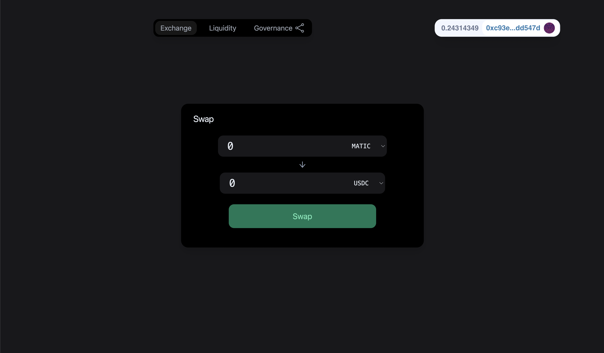

# DEX

A truly decentralized exchange allowing users to swap ERC20 tokens and MATIC.

[dex.philipp.keinberger.com](https://dex.philipp.keinberger.com)



- [DEX](#dex)
  - [About](#about)
  - [User Interfaces](#user-interfaces)
  - [Contracts](#contracts)
    - [DEX](#dex-1)
    - [ILiquidityPool (Interface)](#iliquiditypool-interface)
    - [NativeLiquidityPool](#nativeliquiditypool)
    - [TokenLiquidityPool](#tokenliquiditypool)
    - [DexGovernor](#dexgovernor)
    - [DexGovernanceToken](#dexgovernancetoken)
  - [Built Using](#built-using)
  - [Usage](#usage)
    - [Hardhat](#hardhat)
      - [Prerequisites](#prerequisites)
      - [Testing](#testing)
      - [Deployment](#deployment)
      - [Scripts](#scripts)
  - [License](#license)
  - [Contact](#contact)

## About

Swapping blockchain items like ERC-20 tokens is one of the most popular use cases for decentralized applications on the most popular Smart Contract platforms.

DEXs provide a trustless third-party platform for these kinds of trades. Taking into account the concept of liquidity pools, decentralized exchanges are able to utilize liquidity without the need of a centralized party, while also letting liquidity providers accumulate interest on their deposits over time.

This demo project gives an insight into how the most popular Defi use case can be implemented. The project provides governance of the exchange through a democratized on-chain voting system, liquidity pools enabling users to earn interest and bullet-proof mathematics providing an automated market maker for fair trade.

## User Interfaces

The [Webpage](https://dex.philipp.keinberger.com) provides a way to intuitively and easily use the DEX.

The [Tally Webpage](https://www.tally.xyz/governance/eip155:137:0xC499560F09c323622878cBDaf7322270E84D89B1) provides a way to use the governance features of the DEX.

## Contracts

The project consists of five main contracts (DEX, NativeLiquidityPool, TokenLiquidityPool, DexGovernor, DexGovernanceToken) and the ILiquidityPool interface.

Implemented together, these provide a decentralized exchange platform, which is governed decentrally by governance token holders (shareholders), that govern the DEX through the governor contract (DexGovernor).

All of the contracts, except the liquidity pool contracts, are designed to be upgradeable using the Governor.

### DEX

This contract stores all liquidity pools of the exchange and lets users swap ERC20 and native currency (ETH, MATIC) using these pools.

Adding and removing liquidity pools can only be done using the governor contract.

Adding a new liquidity pool will result in the deployment of such a pool, while native currency has to be transferred to the DEX and ERC20 tokens have to give allowance to the exchange prior to adding. Without the neccessary funds the exchange will not be able to successfully deploy and initialize the liquidity pool.
Adding an already existing liquidity pool can be done by activating it on the DEX. Existing pools have to implement the ILiquidityPool interface.

Users can use the DEX to directly swap at all liquidity pools of the exchange. Swapping through the DEX requires allowance from the user for the exchange to swap on their behalf. This can be enabled through the liquidity pools directly.

The exchange can be access restricted by the governor using the different States of the DEX (OPEN, CLOSED, UPDATING). This can be done for updating the contract, or otherwise wanting to restrict functionality of the exchange.

- For a detailed documentation of the functionality and code of the DEX contract see [DEX Documentation](./hardhat/docs/DEX.md)

### ILiquidityPool (Interface)

This interface specifies all common features of the liquidity pools available on the DEX.

Liquidity pools using this interface have an Allowance feature, allowing swaps to happen on their behalf through a third party, a kind (NativeLiquidityPool or TokenLiquidityPool) and a standardized swap feature with corresponding events.

- For a detailed documentation of the functionality and code of the ILiquidityPool interface see [ILiquidityPool Documentation](./hardhat/docs/ILiquidityPool.md)

### NativeLiquidityPool

This contract provides a liquidity pool where users can swap between an ERC20 token and native currency.

Users may provide liquidity to the pool by depositing native currency to the pool. The user has to approve the exchange to withdraw the amount of tokens required prior to providing liquidity. The amount of native currency and tokens is and has to be in ratio to the current pool reserves. That way, the new deposit will not change the current ratio of the reserves, which would lead to a price change in the liquidity pool.

Providing liquidity to the pool will let liquidity providers accumulate rewards in form of swap fees obtained from swaps in the pool.

Users may withdraw their provided liquidity at any time.

- For a detailed documentation of the functionality and code of the NativeLiquidityPool contract see [NativeLiquidityPool Documentation](./hardhat/docs/NativeLiquidityPool.md)

### TokenLiquidityPool

This contract is a liquidity pool where users can swap between two ERC20 tokens.

Users may provide liquidity to the pool by depositing one the tokens ("X" token, see TokenLiquidityPool Documentation for a more detailed explanation) to the pool. The user has to approve the exchange to withdraw the amount of tokens of the other token required prior to providing liquidity. The amount of the tokens is and has to be in ratio to the current pool reserves. That way, the new deposit will not change the current ratio of the reserves, which would lead to a price change in the liquidity pool.

Providing liquidity to the pool will let liquidity providers accumulate rewards in form of swap fees obtained from swaps in the pool.

Users may withdraw their provided liquidity at any time.

- For a detailed documentation of the functionality and code of the TokenLiquidityPool contract see [TokenLiquidityPool Documentation](./hardhat/docs/TokenLiquidityPool.md)

### DexGovernor

This contract functions as the governor and owner of the exchange. Governance token holders can propose new proposals and vote on proposals. These proposals may include using access-restricted features of the DEX contract, adding/removing liquidity pools to the exchange or upgrading the DEX, DexGovernanceToken and DexGovernor contracts.

### DexGovernanceToken

This contracts implements the ERC-20 governance token for shareholders of the DEX.

- For a detailed explanation of ERC20 tokens see [ERC-20 Token Standard](https://ethereum.org/en/developers/docs/standards/tokens/erc-20/)

## Built Using

This project was built using multiple technologies, the most notable ones being below.

- [Hardhat](https://hardhat.org/)
- [NextJS](https://nextjs.org/)
- [TheGraph](https://thegraph.com/)
- [Moralis](https://moralis.io/)
- [Ethers](https://ethers.io/)
- [Waffle](https://getwaffle.io/)
- [OpenZeppelin-Contracts](https://openzeppelin.com/contracts)

## Usage

The project can be used through the live implementation on Polygon.

[Webpage](https://dex.philipp.keinberger.com) | [Polyscan](https://polygonscan.com/address/0x727eccd76765edd99f9d36f9e5bcc571c6d0e5e4) | [Tally](https://www.tally.xyz/governance/eip155:137:0xC499560F09c323622878cBDaf7322270E84D89B1)

Apart from that, one may clone this repo and use the Hardhat project on its own.

### Hardhat

The Hardhat project consists of the Smart Contracts, tests, scripts and overall backend functionality of the project.

#### Prerequisites

1. Clone the repo
   ```sh
   git clone https://github.com/keinberger/sol-dex
   ```
2. Make sure you have a node package manager like [YARN](https://yarnpkg.com/) or [NPM](https://docs.npmjs.com/downloading-and-installing-node-js-and-npm) installed
3. Install dependencies
   ```sh
   yarn install
   ```
4. Edit `hardat.config.js` and `helper-hardhat-config.js` to fit your needs.

#### Testing

To test the contracts for functionality run the command below

```sh
yarn hardhat test
```

#### Deployment

In order to deploy the contracts on a blockchain run

```sh
yarn hardhat deploy (optional: network)
```

The deploy scripts will take care of setting up the contracts, so access-control,
upgradeability and other features are set up properly.

> **Note**: The deployer still retains all governance tokens after deployment. In a real implementation of the project, the tokens would need to be
> distributed among shareholders of the project, to provide true decentralized governance of the marketplace.

#### Scripts

The repo provides several scripts for interacting with the DEX, liquidity pools or the governor (DAO), which can be found in the `hardhat/scripts` folder.

The scripts uses the `helper-hardhat-config.js` for input values. In order to run these scripts, you have
to edit the `scriptsConfig` section and the corresponding `governance`, `dex`, `fundTimelock`, `nlp`, `tlp` objects accordingly.

<p align="right">(<a href="#governed-nft-marketplace">back to top</a>)</p>

## License

Distributed under the GPL-3.0 License. See `LICENSE` for more information.

<p align="right">(<a href="#governed-nft-marketplace">back to top</a>)</p>

## Contact

Philipp Keinberger - [philipp.keinberger.com](https://philipp.keinberger.com) - [@phil10013](https://twitter.com/phil10013) - philipp.keinberger@gmail.com

Project Link: [https://github.com/keinberger/sol-dex](https://github.com/keinberger/sol-dex)

Project Webpage: [dex.philipp.keinberger.com](https://dex.philipp.keinberger.com)

<p align="right">(<a href="#governed-nft-marketplace">back to top</a>)</p>
